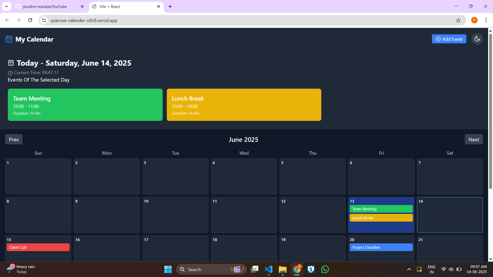
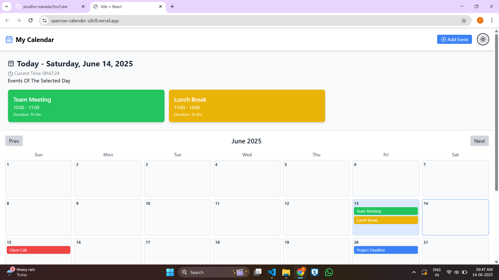

***************Calendar***************

A responsive calendar application built with **React**, **Tailwind CSS**, and **Day.js**. It supports **dark/light mode toggling**, loads events from a JSON file, and displays daily events with color labels.

##  Tech Stack

###  Frontend

- **React.js + Vite** — Fast development environment with modern tooling.
- **Tailwind CSS** — Utility-first CSS framework used for responsive and dark/light theme support.
- **Day.js** — Lightweight JavaScript library for date formatting and manipulation.
- **Responsive Design** — Fully adaptable layout for mobile, tablet, and desktop screens.
- **Dark/Light Mode Toggle** — Built using Tailwind's `darkMode: 'class'` strategy.
- **Static JSON File Integration** — Events are loaded from a local `events.json` file.

### Deployment
- Vercel 

## How to Run 

-npm install 

-npm run dev 

## Screenshot

###  Dark mode

### Light mode 

